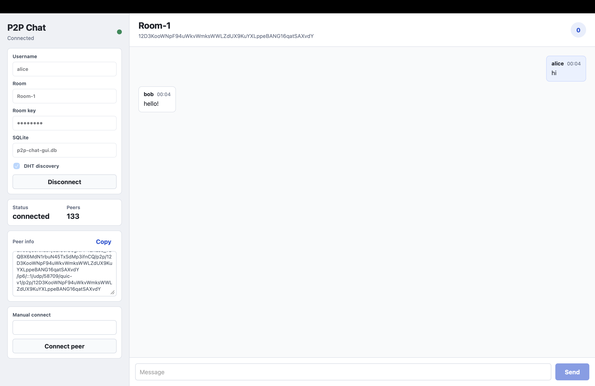

# p2p-chat

P2P-чат на Go/libp2p с desktop GUI на Wails и CLI.

## GUI

Графический интерфейс позволяет пользоваться чатом как обычным desktop-приложением.

<p align="center">
  
</p>

Запуск в dev-режиме:

```sh
go install github.com/wailsapp/wails/v2/cmd/wails@v2.12.0
export PATH="$(go env GOPATH)/bin:$PATH"

cd cmd/p2p-chat-gui
wails dev
```

Сборка приложения:

```sh
cd cmd/p2p-chat-gui
wails build -clean
open -n build/bin/*.app
```

В GUI есть:

- username и room
- private room key
- путь к SQLite БД
- connect/disconnect
- список сообщений и история комнаты
- количество пиров
- manual connect по полному multiaddr
- copy peer info
- DHT on/off

## CLI

Запуск:

```sh
go run ./cmd/p2p-chat \
  -topicName local \
  -room-key shared-secret \
  -userName alice \
  --db-path ./alice.db
```

Флаги:

- `-topicName` имя комнаты
- `-room-key` ключ закрытой комнаты; можно передать через `P2P_CHAT_ROOM_KEY`
- `-userName` имя пользователя
- `--db-path` путь к SQLite БД
- `-peer` полный multiaddr пира; можно указать несколько раз
- `-relay` multiaddr relay v2; можно указать несколько раз
- `-noDHT` отключает Kademlia DHT discovery

Проверка в двух терминалах:

```sh
# terminal 1
go run ./cmd/p2p-chat -topicName local -room-key shared-secret -userName alice --db-path ./alice.db

# terminal 2
go run ./cmd/p2p-chat -topicName local -room-key shared-secret -userName bob --db-path ./bob.db -peer /ip4/127.0.0.1/tcp/PORT/p2p/PEER_ID
```

`-peer` нужно взять из адресов первой ноды. На одной машине и в LAN пиры также могут найти друг друга через mDNS.

## Безопасность

- Комната закрывается через `room-key`.
- Pubsub topic, DHT namespace и mDNS service вычисляются из `room + room-key`.
- Сообщения в сети шифруются через AES-256-GCM.
- Payload сообщений в SQLite также шифруется через AES-256-GCM.
- Ключ SQLite выводится из `room-key`, имени комнаты и per-room salt через Argon2id.
- `room-key` не сохраняется в SQLite settings.

В SQLite остаются plaintext-метаданные: message id, room metadata, sender id, sent time, received time, version.

## SQLite

Используется `database/sql`, `modernc.org/sqlite` и embedded goose migrations.

Схема:

- `rooms`: имя комнаты и encryption salt
- `messages`: метаданные, nonce и encrypted payload
- `settings`: локальные настройки приложения

## Discovery и NAT

Включено:

- mDNS для локального поиска
- Kademlia DHT discovery
- NAT port mapping
- AutoNAT v2
- relay transport и circuit relay v2 service
- DCUtR/hole punching
- AutoRelay при переданных relay-кандидатах

## Проверки

```sh
go test ./...
go vet ./...

cd cmd/p2p-chat-gui/frontend
npm run check
npm run build
```

## Структура

- `cmd/p2p-chat-gui` desktop app
- `cmd/p2p-chat-gui/frontend` Svelte frontend
- `cmd/p2p-chat` CLI
- `internal/chat` chat, libp2p, discovery и messages
- `internal/store/sqlite` SQLite store и migrations
